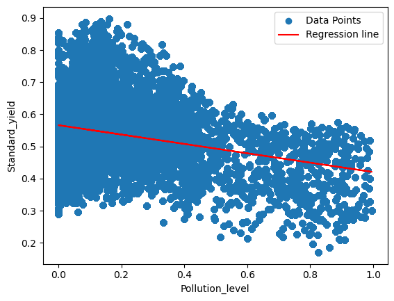
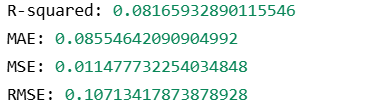
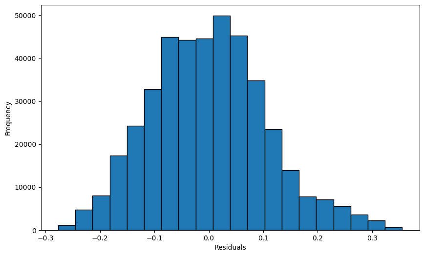
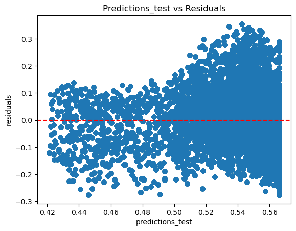

# 🌾 Maji Ndogo Crop Yield Analysis: Linear Regression Project 

This project applies simple linear regression to understand how environmental factors influence crop yields in the fictional region of Maji Ndogo. By modelling relationships between features like pollution levels, average temperature, and standardized crop yields, this analysis demonstrates the foundational machine learning workflow—from data exploration to model evaluation and diagnostics. While the dataset is fictional, the methodology reflects the rigorous approach required when deploying predictive models in real-world business environments.

---

## ⚙️ Key Features

- **Data validation and cleaning** using custom-built Python modules

- **Exploratory data analysis** through scatter plots and correlation analysis

- **Simple linear regression** modelling using scikit-learn

- **Comprehensive model evaluation** with R², MAE, MSE, and RMSE metrics

- **Train-test splitting** to validate model generalization on unseen data

- **Residual analysis** to diagnose model assumptions and identify improvement opportunities

- **Modular function** design for reusability across different features and datasets

## 🔧 Technologies Used

| Category            | Tools / Libraries                                |
|---------------------|--------------------------------------------------|
| Language            | Python 3.11+                                     |
| Data Manipulation   | Pandas, NumPy                                    |
| Machine Learning    | Scikit-learn (LinearRegression, metrics)         |
| Statistical Analysis| SciPy (Pearson correlation)                      |
| Visualization       | Matplotlib                                       |
| Environment         | Jupyter Notebook, SQLite                         |

  
## 🧪 Use Case Scenario

The analysis explores two key research questions:

Does average temperature influence crop yield?

- Initial visualization suggested no clear linear relationship

- Correlation analysis confirmed near-zero linear relationship

Does pollution level affect crop yield?

- Scatter plots revealed a weak negative linear trend

- Linear regression model quantified this relationship

Model evaluation metrics assessed predictive power

### Real-WorldBusiness Questions

- Agriculture	What environmental factors drive crop yields?

- Banking	What variables predict loan default risk?

- Retail	What influences customer spending patterns?

- Healthcare	What factors impact patient readmission rates?

- Manufacturing	What conditions predict equipment failure?

## 🔧 System Architecture

This project follows a structured machine learning workflow:

Data Ingestion: SQLite database connection using SQLAlchemy

Data Validation: Automated tests using pytest to ensure data integrity

Exploratory Analysis: Visualizations and correlation analysis

Model Building: Simple linear regression using scikit-learn

Model Evaluation: Performance metrics (R², MAE, MSE, RMSE)

Model Validation: Train-test split for generalization assessment

Residual Diagnostics: Histograms and scatter plots to validate assumptions

Interpretation: Translating coefficients and metrics into business insights

## 📊 Visualizations

### Relationship Between Pollution and Crop Yield

    <em>Scatter plot with regression line showing weak negative relationship between pollution levels and standardized crop yield</em> 

### Model Evaluation Metrics

    <em>R², MAE, MSE, and RMSE quantify model performance</em> 

### Residual Diagnostics

     <em>Residual histogram (left) and residuals vs. predictions scatter plot (right) reveal model assumptions and fit quality</em> 

## ❄️ Key Findings
1. Average Temperature vs. Standard Yield
Correlation: ~0.00065 (effectively zero)

Interpretation: No linear relationship—temperature alone does not predict yield

Business Lesson: Not every feature is predictive; knowing what doesn't matter saves time and resources

2. Pollution Level vs. Standard Yield
Correlation: -0.292

Model Slope: -0.146 (each unit increase in pollution reduces yield by ~0.15 units)

R² Score: 0.085 (on test data)

Interpretation: Weak negative relationship—higher pollution correlates with slightly lower yields, but other factors dominate

Business Lesson: Even weak signals can be valuable when combined with other features in multiple regression

3. Model Diagnostics
Residual Distribution: Slightly skewed, indicating non-normal errors

Heteroscedasticity: Residual spread increases with predicted values—variance isn't constant

Mean Residual: ~ -0.00009 (effectively zero—unbiased predictions)

Residual Std Dev: ~0.107 (prediction errors average ~0.11 units)

Business Lesson: Model assumptions matter. Violations don't always break a model, but they inform how much we trust predictions

## 💡 Key Takeaways
- Hypothesis testing: Not all features are predictive—validate before investing in complex models

- Visualization first: Always plot your data before modeling

- Evaluation matters: R², MAE, MSE, and RMSE tell different stories about model performance

- Train-test split: Models must prove themselves on unseen data

- Residual analysis: Diagnosing model assumptions prevents blind trust in predictions

- Modular design: Reusable functions enable rapid experimentation across features

- Simple models first: Linear regression provides interpretable baselines before advancing to complex algorithms

## 🔍 How This Translates to Production
In a real data team, this skillset enables me to:

- Identifying linear relationships	Spotting which factors truly drive business outcomes
- Quantifying prediction uncertainty	Making decisions with confidence intervals, not guesses
- Validating model generalization	Ensuring models work on new data, not just historical
- Diagnosing model assumptions	Avoiding costly mistakes when models fail silently
- Communicating results	Translating coefficients and metrics into stakeholder language
- Iterative improvement	Using diagnostics to guide feature engineering and model selection

---

👨🏽‍💻 Author
Sithsaba Zantsi
Data Engineer | Data Science Mentor

📜 License
This project is for educational purposes and does not hold any proprietary data or licensing constraints. The dataset is fictional and created for learning purposes by ALX and ExploreAI Academy.
